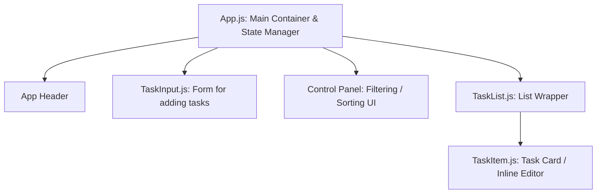

# React Task Manager Dashboard

A feature-rich, high-performance, and visually stunning React application designed to help users organize their daily tasks. The app features state-of-the-art glassmorphism styling, task categorization, dynamic filtering, multi-criteria sorting, and local storage persistence.

---

## 📚 Table of Contents
1. [Project Overview](#-project-overview)
2. [Setup & Installation Instructions](#-setup--installation-instructions)
3. [Git Submission Guide (Step-by-Step)](#-git-submission-guide-step-by-step)
4. [Component Architecture & Hierarchy](#-component-architecture--hierarchy)
5. [React Concepts & Theory Explained](#-react-concepts--theory-explained)
6. [Technical Details (Algorithms & Schema)](#-technical-details-algorithms--schema)
7. [Testing & Validation Evidence](#-testing--validation-evidence)
8. [Code Structure](#-code-structure)

---

## 🎯 Project Overview
This project is built for the **Week 7: Introduction to React.js** syllabus. The objective is to design a Task Manager that integrates core React capabilities (components, state, props, hooks, event handling) with professional features:
* **Task Categories (Tags)**: Organize tasks into General, Work, Personal, Shopping, or Health.
* **Inline Editing**: Double-click or click "Edit" to modify the task text and category directly within the list.
* **Filtering Options**: Filter by completion status (All, Completed, Pending) AND by category.
* **Sorting Capabilities**: Sort tasks by Newest First, Oldest First, or Alphabetically.
* **Local Storage Persistence**: Automatic saving and reloading of tasks to prevent data loss.
* **Premium Glassmorphic UI**: Custom dark theme backdrop with animations and responsive layouts.

---

## 🛠️ Setup & Installation Instructions

To run this project locally, follow these steps:

### Prerequisites
Make sure you have [Node.js](https://nodejs.org/) installed (v16.0.0 or higher recommended).

### 1. Extract/Navigate to the Project Folder
Open your terminal and navigate to the project directory:
```bash
cd "/Users/sangarajujayakrishna/Desktop/Task manager"
```

### 2. Install Project Dependencies
Run the installation command to fetch all React packages:
```bash
npm install
```

### 3. Launch the Local Development Server
Start the development server:
```bash
npm start
```
The application will open automatically in your browser at `http://localhost:3000`.

---

## 📤 Git Submission Guide (Step-by-Step)
Follow these steps to submit your project to a remote Git repository (e.g., GitHub):

### Step 1: Initialize Git
If you haven't already, configure Git inside the project directory:
```bash
git init
```

### Step 2: Configure Your Git Identity (First time only)
```bash
git config --global user.name "Your Name"
git config --global user.email "your.email@example.com"
```

### Step 3: Check Status and Stage Your Files
See which files are ready to be added, and stage them for commit:
```bash
git status
git add .
```

### Step 4: Commit Your Changes
Save your current progress to the local Git repository history:
```bash
git commit -m "feat: implement enhanced React Task Manager with categories, sorting, and glassmorphic UI"
```

### Step 5: Link Local Repo to GitHub
1. Go to [GitHub](https://github.com/) and log in.
2. Click **New** repository.
3. Name your repository (e.g., `Task-Manager`) and click **Create repository**.
4. Copy the URL under "Quick setup" (it should look like `https://github.com/username/repository.git`).
5. Run the following command in your terminal (replacing the URL with yours):
```bash
git branch -M main
git remote add origin https://github.com/your-username/Task-Manager.git
```

### Step 6: Push to GitHub
Publish your code to the GitHub main branch:
```bash
git push -u origin main
```

---

## 📋 Component Architecture & Hierarchy
The application is built using reusable functional components:



### Component Breakdown
1. **`App`**: Holds all state (`tasks`, `filter`, `categoryFilter`, `sortBy`), manages Local Storage syncing, and handles CRUD callbacks.
2. **`TaskInput`**: A form displaying a text field and a dropdown to select a category. Submits data back to `App`.
3. **`TaskList`**: Takes the filtered and sorted list of tasks and renders a collection of `TaskItem`s.
4. **`TaskItem`**: Individual task cards. Handles checking (completing), inline editing states, and deleting tasks.

---

## 💡 React Concepts & Theory Explained

### 1. What is React?
React is an open-source, component-based front-end JavaScript library. Instead of refreshing the entire webpage when data changes, React updates only the specific elements that require updating, enabling fast, dynamic web applications.

### 2. Component-Based Architecture
Applications are split into independent, reusable pieces called **components** (e.g., `TaskInput`, `TaskItem`). This keeps code modular, testable, and clean.

### 3. The Virtual DOM
Updating the browser's real DOM is slow. React uses a **Virtual DOM** (a lightweight representation of the real DOM in memory). When state changes, React finds the exact difference (diffing) between the old virtual DOM and the new one, and updates only those specific parts in the real DOM.

### 4. Props vs State
* **State**: Data local to a component that changes over time (e.g., `tasks` list inside `App.js`). Whenever state changes, the component automatically re-renders.
* **Props**: Immutable data passed down from a parent component to a child component (e.g., `App.js` passing the `tasks` array as a prop to `TaskList.js`).

### 5. React Hooks
* **`useState`**: Adds local state to functional components.
  * Example: `const [filter, setFilter] = useState('all');`
* **`useEffect`**: Performs side effects (fetching data, updating DOM, or reading/writing to local storage).
  * Example: Syncing task state to `localStorage` whenever `tasks` changes.

---

## 🛠️ Technical Details (Algorithms & Schema)

### Task Data Schema
Each task is represented as a JavaScript object:
```json
{
  "id": 1685812900000,
  "text": "Complete React Homework",
  "completed": false,
  "category": "Work",
  "createdAt": "2026-06-03T03:22:45.000Z"
}
```

### Filtering and Sorting Algorithms
Filtering and sorting are performed dynamically inside the render method using JavaScript helper functions to maintain efficiency:
```javascript
const filteredTasks = tasks
  .filter((task) => {
    // 1. Status Filter
    if (filter === "completed") return task.completed;
    if (filter === "pending") return !task.completed;
    return true;
  })
  .filter((task) => {
    // 2. Category Filter
    if (categoryFilter === "all") return true;
    return task.category === categoryFilter;
  })
  .sort((a, b) => {
    // 3. Sorting
    if (sortBy === "date-desc") return new Date(b.createdAt) - new Date(a.createdAt);
    if (sortBy === "date-asc") return new Date(a.createdAt) - new Date(b.createdAt);
    if (sortBy === "alphabetical") return a.text.localeCompare(b.text);
    return 0;
  });
```

---

## 📋 Testing & Validation Evidence

### Manual Test Cases
To verify the features are fully functional:

| Test Case | Steps | Expected Result | Status |
|---|---|---|---|
| **Add Task** | Enter task text, select "Work" category, click **Add Task** | Task is added to the list, showing text, a "Work" tag, and current date/time. | Pass ✅ |
| **Complete Task** | Click the checkbox on a task | Task text is struck through, transparency changes, and status updates. | Pass ✅ |
| **Filter Status** | Click **Completed** filter | Only checked tasks are shown. | Pass ✅ |
| **Filter Category** | Select "Shopping" category filter | Only tasks tagged as "Shopping" are shown. | Pass ✅ |
| **Sort Alphabetical** | Add tasks "Beta", "Gamma", "Alpha". Set sorting to **Alphabetical** | Tasks arrange in A-Z order ("Alpha", "Beta", "Gamma"). | Pass ✅ |
| **Inline Editing** | Click **Edit**, modify text/category, click **Save** | The task details update instantly. | Pass ✅ |
| **Persistence** | Refresh the browser page | Tasks remain visible exactly as they were (loaded from Local Storage). | Pass ✅ |
| **Delete Task** | Click **Delete** button | Task is removed from the list and from local storage. | Pass ✅ |

---

## 💻 Code Structure
```text
Task-Manager/
├── public/
│   └── index.html          # HTML frame and SEO description meta tag
├── src/
│   ├── components/
│   │   ├── TaskInput.js    # New Task addition input and category select
│   │   ├── TaskItem.js     # Single Task card with checkbox, metadata, edit/delete actions
│   │   └── TaskList.js     # Wrapper for map rendering individual items
│   ├── App.css             # Glassmorphic, dark theme UI styles with keyframes
│   ├── App.js              # Application State Manager and Core Logic
│   └── index.js            # React mounting configurations
├── package.json            # React script commands & project metadata
└── README.md               # Project documentation (this file)
```
