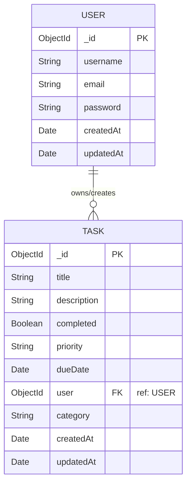

# 🚀 Secure Task Management API (MongoDB & Node.js)

A production-grade RESTful API for task management, built using **Node.js**, **Express.js**, and **MongoDB (Mongoose ODM)**. Features secure user authentication (JWT), password hashing (Bcrypt), full CRUD operations for tasks with user associations, data validation, database indexing, and query pagination/filtering.

---

## 📚 Table of Contents
1. [Project Overview & Objectives](#-project-overview--objectives)
2. [Database Schema & ER Relationships](#-database-schema--er-relationships)
3. [Setup & Installation Guide](#-setup--installation-guide)
4. [Core Database Concepts Explained](#-core-database-concepts-explained)
5. [Architecture & Code Structure](#-architecture--code-structure)
6. [API Endpoint Specifications](#-api-endpoint-specifications)
7. [Testing Evidence & Validation](#-testing-evidence--validation)
8. [Deployment Guidelines](#-deployment-guidelines)

---

## 🎯 Project Overview & Objectives
This API provides a secure and scalable backend to manage tasks, featuring:
- **MongoDB Database Integration**: Storing persistent relational data in a NoSQL environment using Mongoose schemas.
- **Data Validation & Pre-Hooks**: Validating inputs (e.g. priority constraints) and capitalizing title strings before saves.
- **Relationship Mapping**: Linking tasks directly to the user who created them (One-to-Many relationship).
- **Pagination, Sorting, & Filtering**: Restricting payload size and querying tasks by category, priority, or completed status.

---

## 📊 Database Schema & ER Relationships

The database utilizes a **One-to-Many relationship**: a `User` can own multiple `Tasks`, but each `Task` belongs to exactly one `User`.

### ER Diagram (Mermaid)



### Database Attributes & Schema Constraints

| Collection | Field Name | Data Type | Key Type | Constraints / Defaults |
| :--- | :--- | :--- | :--- | :--- |
| **users** | `_id` | ObjectId | Primary Key | Auto-generated by MongoDB |
| | `username` | String | | Required, unique, trimmed, length: [3, 30] |
| | `email` | String | | Required, unique, trimmed, lowercase, regex email format |
| | `password` | String | | Required, minlength: 6, hidden (`select: false`) |
| **tasks** | `_id` | ObjectId | Primary Key | Auto-generated by MongoDB |
| | `title` | String | | Required, trimmed, length: [3, 200], capitalized pre-save |
| | `description`| String | | Trimmed, max length: 1000 |
| | `completed` | Boolean | | Default: `false` |
| | `priority` | String | | Enum: `['low', 'medium', 'high']`, Default: `medium` |
| | `dueDate` | Date | | Optional |
| | `user` | ObjectId | Foreign Key| Required (References `users._id`, Compound Indexed) |
| | `category` | String | | Enum: `['work', 'personal', 'shopping', 'health', 'other']`, Default: `personal` |

---

## 🛠️ Setup & Installation Guide

### Prerequisites
- **Node.js** (v18.0.0 or higher recommended)
- **npm** (v9.0.0 or higher)
- **MongoDB** (A running local daemon or a MongoDB Atlas cloud cluster URI)

### 1. Install Dependencies
```bash
npm install
```

### 2. Configure Environment Variables
Create a `.env` file in the root directory (based on `.env.example`):
```env
PORT=3000
NODE_ENV=development
MONGODB_URI=mongodb://127.0.0.1:27017/task-db
JWT_SECRET=super_secret_blog_api_dev_key_12345
JWT_EXPIRES_IN=7d
```

### 3. Run the Server
#### Development Mode (With Auto-Restart)
```bash
npm run dev
```
#### Production Mode
```bash
npm start
```
The server runs at `http://localhost:3000` and Swagger documentation is served at `http://localhost:3000/api-docs`.

---

## 🧠 Core Database Concepts Explained

### 1. NoSQL Databases & MongoDB
Unlike relational SQL databases, MongoDB is a **NoSQL document database**. It stores data in JSON-like format called **BSON** (Binary JSON). This provides:
- **Flexible Schema Structure**: Documents in the same collection do not need to share the same fields, allowing for quick schema updates.
- **Scalability**: Designed to scale out horizontally by sharding data across multiple servers.

### 2. Mongoose ODM (Object Document Mapper)
Mongoose acts as a bridge between Node.js and MongoDB, providing structure and validation:
- **Schemas & Models**: Defines the structure of the documents and turns them into models we can query.
- **Validations**: Enforces constraints (e.g. enums, min/max values) at the application level before data is sent to MongoDB.
- **Middleware Pre-Hooks**: Allows executing code before certain operations, such as hashing passwords before `save` or capitalizing titles.
- **Indexes**: Adds indexes to database collections to speed up common searches (e.g., compound index on `{ user: 1, completed: 1 }`).

---

## 💻 Architecture & Code Structure

```text
Task-Manager/
├── src/
│   ├── config/
│   │   └── database.js         # Mongoose connection setup & shutdown handlers
│   ├── controllers/
│   │   ├── userController.js   # User registration, login, and profile fetching
│   │   └── taskController.js   # Task CRUD, pagination, and sorting
│   ├── middleware/
│   │   ├── auth.js             # JWT extraction, verification, & req.userId inject
│   │   ├── errorHandler.js     # Unified error parser (Cast, Validation, Dups, JWT)
│   │   ├── logger.js           # Terminal logger printing path and speed
│   │   └── validation.js       # Pre-validation of input formats (email, length, etc.)
│   ├── models/
│   │   ├── User.js             # User Schema (pre-save hash, comparePassword helper)
│   │   └── Task.js             # Task Schema (enums, indexes, pre-save capitalize)
│   ├── routes/
│   │   ├── userRoutes.js       # User auth endpoints and Swagger configurations
│   │   └── taskRoutes.js       # Task CRUD endpoints and Swagger configurations
│   └── tests/
│       └── test_api.js         # Integration tests running in-memory (0 dependency)
├── server.js                   # Server bootloader, Swagger compiler, route register
├── package.json                # Project configurations & dependency versions
├── .env.example                # Template environmental setups
└── README.md                   # Full documentation (this file)
```

---

## 📋 API Endpoint Specifications

### 🔑 Authentication (`/api/auth`)

#### 1. Register User
- **Endpoint**: `POST /api/auth/register`
- **Access**: Public
- **Request Body**:
  ```json
  {
    "username": "john_doe",
    "email": "john@example.com",
    "password": "password123"
  }
  ```
- **Response (201 Created)**: Returns the user ID and a signed JWT authorization token.

#### 2. Login User
- **Endpoint**: `POST /api/auth/login`
- **Access**: Public
- **Request Body**:
  ```json
  {
    "email": "john@example.com",
    "password": "password123"
  }
  ```
- **Response (200 OK)**: Returns profile and JWT.

#### 3. Get Profile
- **Endpoint**: `GET /api/auth/profile`
- **Access**: Private (Requires `Authorization: Bearer <token>`)
- **Response (200 OK)**: Returns profile details.

---

### 📝 Tasks (`/api/tasks`)

#### 1. Create Task
- **Endpoint**: `POST /api/tasks`
- **Access**: Private (Requires `Authorization: Bearer <token>`)
- **Request Body**:
  ```json
  {
    "title": "complete task API",
    "description": "Write mongoose models and verify connections.",
    "priority": "high",
    "category": "work",
    "dueDate": "2026-07-05T12:00:00Z"
  }
  ```
- **Response (201 Created)**: Returns the task document. Notice that the title will be capitalized to `"Complete task API"` automatically before saving.

#### 2. Get All Tasks
- **Endpoint**: `GET /api/tasks`
- **Access**: Private (Requires `Authorization: Bearer <token>`)
- **Query Parameters**:
  - `completed` (boolean string): Filter by completion status (`?completed=false`).
  - `priority` (string): Filter by priority (`?priority=high`).
  - `category` (string): Filter by category (`?category=work`).
  - `page` (number, default: `1`): Pagination page.
  - `limit` (number, default: `10`): Max results.
- **Response (200 OK)**: Returns the user's tasks list and pagination metadata.

#### 3. Get Task By ID
- **Endpoint**: `GET /api/tasks/:id`
- **Access**: Private (Task Owner only)
- **Response (200 OK)**: Returns details of a specific task.

#### 4. Update Task
- **Endpoint**: `PUT /api/tasks/:id`
- **Access**: Private (Task Owner only)
- **Request Body**:
  ```json
  {
    "completed": true,
    "priority": "medium"
  }
  ```
- **Response (200 OK)**: Returns the updated task document.

#### 5. Delete Task
- **Endpoint**: `DELETE /api/tasks/:id`
- **Access**: Private (Task Owner only)
- **Response (200 OK)**: Deletes the task from database.

---

## 🧪 Testing Evidence & Validation

A self-contained integration test suite is included in [test_api.js](file:///Users/sangarajujayakrishna/Desktop/Task%20manager/src/tests/test_api.js). It mocks Mongoose operations in-memory to ensure you can run validation tests out-of-the-box.

### Run Tests:
```bash
node src/tests/test_api.js
```

### Successful Test Log Output:
```text
[MOCK DB] MongoDB Mock Connection Established
====================================================
🚀 Task Manager API Server running in test mode
🌐 Local URL: http://localhost:3001
📚 API Documentation: http://localhost:3001/api-docs
====================================================
MongoDB Connected: in-memory-mock-tasks-db

============================================
🏁 RUNNING TASK MANAGER API INTEGRATION TESTS
============================================

[2026-06-30T16:52:36.400Z] GET /api/health 200 - 7ms
✅ PASS: Health Check /api/health
[2026-06-30T16:52:36.497Z] POST /api/auth/register 201 - 81ms
✅ PASS: Register New User /api/auth/register
[2026-06-30T16:52:36.499Z] POST /api/auth/register 400 - 1ms
✅ PASS: Prevent Duplicate Email Registration
[2026-06-30T16:52:36.572Z] POST /api/auth/login 200 - 72ms
✅ PASS: Login User /api/auth/login
[2026-06-30T16:52:36.573Z] GET /api/auth/profile 200 - 1ms
✅ PASS: Get User Profile /api/auth/profile
[2026-06-30T16:52:36.575Z] POST /api/tasks 201 - 1ms
✅ PASS: Create Task with Capitalized Title
[2026-06-30T16:52:36.575Z] POST /api/tasks 401 - 0ms
✅ PASS: Prevent Unauthenticated Task Creation
[2026-06-30T16:52:36.577Z] GET /api/tasks?page=1&limit=5 200 - 1ms
✅ PASS: Get Tasks Paginated /api/tasks
[2026-06-30T16:52:36.577Z] GET /api/tasks?completed=false&priority=high 200 - 0ms
✅ PASS: Get Tasks with Filter Options
[2026-06-30T16:52:36.579Z] GET /api/tasks/mock_task_9os92o4n8 200 - 1ms
✅ PASS: Get Single Task by ID /api/tasks/:id
[2026-06-30T16:52:36.580Z] PUT /api/tasks/mock_task_9os92o4n8 200 - 1ms
✅ PASS: Update Task to Completed
[2026-06-30T16:52:36.580Z] DELETE /api/tasks/mock_task_9os92o4n8 200 - 0ms
✅ PASS: Delete Task by ID

============================================
📊 TASK MANAGER TEST RESULTS
   Passed: 12 / 12
   Failed: 0
============================================
```

---

## 🚀 Deployment Guidelines

### Deploying to Render
1. Connect your repository to **Render.com** as a **Web Service**.
2. Configure environment variables in the dashboard:
   - `MONGODB_URI` = `mongodb+srv://...` (Your MongoDB Atlas connection string)
   - `JWT_SECRET` = `[ProductionSecretKey]`
   - `NODE_ENV` = `production`
3. Launch with `npm install` and `npm start`.
