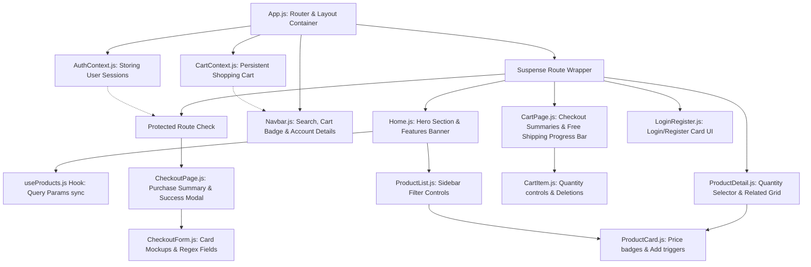

# AURA E-Commerce Application

A fully functional, responsive, and visually stunning React e-commerce application featuring product catalog filtering and sorting, item detail views, persistent shopping carts, simulated user authorization, secure checkout regex form validation, and performance-optimized code-splitting configurations.

---

## 📚 Table of Contents
1. [Project Overview](#-project-overview)
2. [Component Architecture & Data Flow](#-component-architecture--data-flow)
3. [State Management (Context API)](#-state-management-context-api)
4. [API Integration & Fail-Safe Fallback](#-api-integration--fail-safe-fallback)
5. [Performance Optimizations](#-performance-optimizations)
6. [Testing & Validation Evidence](#-testing--validation-evidence)
7. [Setup & Local Installation Guide](#-setup--local-installation-guide)
8. [Code Structure](#-code-structure)

---

## 🎯 Project Overview
This Capstone Project brings together advanced frontend concepts including:
* **Modern Routing**: Utilizes `react-router-dom` (v6) for deep linking, dynamic product detailing routes, and authentication guards.
* **Persistent Cart**: Automatically saves shopping cart items, quantities, and calculations to `localStorage`.
* **Simulated User Auth**: A mock database flow that enables user registration and logins (persisting sessions using `localStorage`).
* **Regex Checkout Form Validation**: Standard client-side checks for card lengths, CVV, expiry formats, and emails.
* **Premium Glassmorphic UI**: Adapts custom CSS theme variables to render smooth visual layouts and responsiveness (including dark/light mode toggles).

---

## 📋 Component Architecture & Data Flow

Below is the visual structure representing the component hierarchies and state flows:



### Component Roles
1. **`Navbar`**: Responsive header hosting search inputs, cart count badges, dark/light toggles, and user account actions.
2. **`ProductCard`**: Display card with ratings, prices, hover scaling, and checkmark add to cart animations.
3. **`ProductList`**: Dynamic catalog layout containing sidebar filters (rating stars, category list, max-price range inputs) and sorting selectors.
4. **`CartItem`**: Flex rows for cart management, adjusting quantity counters, and subtotal displays.
5. **`CheckoutForm`**: Interactive input sections displaying a credit card mockup that updates in real-time as users type details.

---

## 🛡️ State Management (Context API)

### 1. AuthContext (`src/contexts/AuthContext.js`)
Manages user sessions, registration records, and session data.
* **Schema**:
  * `user`: `{ id, name, email }` (stored in `localStorage` as `ecommerce_user`).
  * `loading`: Determines if local storage is being checked on mount.
* **Credentials Demo**:
  * Email: `admin@gmail.com`
  * Password: `admin123`

### 2. CartContext (`src/contexts/CartContext.js`)
Centralizes checkout pricing metrics and items.
* **Calculations**:
  * `cartCount`: Total quantities in the cart.
  * `cartSubtotal`: Sum of `price * quantity`.
  * `cartShipping`: Shipping fee ($9.99, or free for orders over $100).
  * `cartTax`: 8% sales tax.
  * `cartTotal`: Sum of subtotal, shipping, and tax.
* **Operations**: `addToCart()`, `removeFromCart()`, `updateQuantity()`, `clearCart()`.

---

## 🌐 API Integration & Fail-Safe Fallback

Our API manager (`src/services/api.js`) communicates with **FakeStoreAPI** endpoints to retrieve categories and products. If FakeStoreAPI goes offline, is rate-limited, or has slow response times, the service catches the network failure and returns cached mock products.

* **Endpoints used**:
  * `GET /products`
  * `GET /products/:id`
  * `GET /products/categories`

---

## ⚡ Performance Optimizations

1. **Lazy Loading**: Router paths utilize `React.lazy()` and `React.Suspense` to split code chunks (e.g. `main.js`, `cart.chunk.js`, `detail.chunk.js`), reducing initial page load weight.
2. **Memoized Computations**: Heavy operations, such as filters/sorts in `useProducts.js` and total sums in `CartContext.js`, are wrapped in `useMemo` so that they only recalculate when their dependencies change.
3. **Image Optimization**: Card images use native HTML `loading="lazy"` tags to prevent blockages during catalog grids rendering.

---

## 📋 Testing & Validation Evidence

### Manual Verification Cases

| Test Feature | Steps | Expected Result | Status |
|---|---|---|---|
| **Catalog Filter** | Click "Electronics" category | Only electronics products are shown in the grid. | Pass ✅ |
| **Catalog Search** | Type "backpack" in search bar | Grid filters down to matching title items instantly. | Pass ✅ |
| **Price Slider** | Drag price slider to $50.00 | Only items priced under $50.00 remain visible. | Pass ✅ |
| **Persistence** | Add items, refresh browser page | Cart badge number and items list persist exactly. | Pass ✅ |
| **Free Shipping Meter** | Add $80 worth of items, review Cart Page | Progress bar displays and alerts that $20 more unlocks free shipping. | Pass ✅ |
| **Auth Route Guard** | Visit `/checkout` while logged out | Redirected to `/login` with location parameters preserved. | Pass ✅ |
| **Demo Login** | Type `admin@gmail.com` and `admin123` | Logged in successfully, redirecting to Checkout automatically. | Pass ✅ |
| **Checkout Error Checks** | Submit billing with blank fields or card length `< 16` | Specific error boundaries show underneath input lines. | Pass ✅ |
| **Secure Checkout Success** | Submit valid details in the form | Modal popup shows Order Number, Receipt totals, and clears Cart. | Pass ✅ |

---

## 🛠️ Setup & Local Installation Guide

### Prerequisites
Ensure you have [Node.js](https://nodejs.org/) installed (v16.0.0 or higher recommended).

### 1. Clone & Navigate
```bash
cd "/Users/sangarajujayakrishna/Desktop/Task manager"
```

### 2. Install Packages
```bash
npm install
```

### 3. Launch Development Server
```bash
npm start
```
The app will open automatically at `http://localhost:3000`.

### 4. Build Production Bundle
```bash
npm run build
```

---

## 💻 Code Structure
```text
AURA-ECommerce/
├── public/                 # HTML framework and asset configurations
├── src/
│   ├── components/
│   │   ├── Cart/
│   │   │   ├── CartItem.js      # Cart row card with item counters
│   │   │   └── CartItem.css
│   │   ├── Checkout/
│   │   │   ├── CheckoutForm.js  # Form validation & Card mockup display
│   │   │   └── CheckoutForm.css
│   │   ├── Navbar/
│   │   │   ├── Navbar.js        # Header search, badges & theme toggling
│   │   │   └── Navbar.css
│   │   ├── ProductCard/
│   │   │   ├── ProductCard.js   # Single item catalog display card
│   │   │   └── ProductCard.css
│   │   └── ProductList/
│   │       ├── ProductList.js   # Main layout catalog with filter sidebar
│   │       └── ProductList.css
│   ├── contexts/
│   │   ├── AuthContext.js       # Stored credentials & active login state
│   │   └── CartContext.js       # Persistent array calculations
│   ├── hooks/
│   │   └── useProducts.js       # Query selectors & product searches hook
│   ├── pages/
│   │   ├── CartPage.js          # Cart details view & Free shipping indicator
│   │   ├── CheckoutPage.js      # Billing forms and order receipt details
│   │   ├── Home.js              # Home banner, marketing lists and featured grids
│   │   ├── LoginRegister.js     # Auth templates
│   │   └── ProductDetail.js     # Specific item details & same-category suggestions
│   ├── services/
│   │   └── api.js               # API controllers with offline mock database
│   ├── styles/
│   │   ├── theme.css            # Adaptive variables & HSL themes
│   │   └── global.css           # Global resets and loading shimmer animations
│   ├── App.js                   # Routing setups & Error Boundaries
│   └── index.js                 # React mounting configurations
├── package.json                 # Script commands & package dependencies
└── README.md                    # Project documentation (this file)
```
